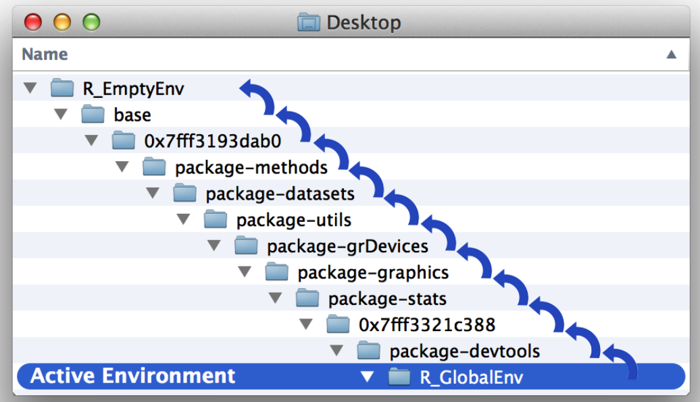

```{r setup, include=FALSE}
knitr::opts_chunk$set(echo = TRUE)
```

# 7 Modifying Values

你准备好用你的虚拟牌组玩一些游戏了吗？不要那么快！你牌组中的点数系统与许多纸牌游戏不太一致。例如，在战争和扑克中，王牌的得分通常高于国王。它们的点值是14，而不是1。

在这项任务中，你将改变牌组的点数系统三次，以匹配三种不同的游戏：战争、红心大战和21点(war, hearts, and blackjack)。这些游戏中的每一个都会教你一些关于修改数据集内部值的不同内容。首先制作一个可以操作的牌组副本。这将确保您始终拥有一份原始的牌组（如果出现问题）：

```{r}
deck = data.frame(face = c("king", "queen", "jack", "ten", "nine", "eight", "seven", "six",
                          "five", "four", "three", "two", "ace", "king", "queen", "jack", "ten", 
                          "nine", "eight", "seven", "six", "five", "four", "three", "two", "ace", 
                          "king", "queen", "jack", "ten", "nine", "eight", "seven", "six", "five", 
                          "four", "three", "two", "ace", "king", "queen", "jack", "ten", "nine", 
                          "eight", "seven", "six", "five", "four", "three", "two", "ace"),
                  suit = c("spades", "spades", "spades", "spades", "spades", "spades", 
                          "spades", "spades", "spades", "spades", "spades", "spades", "spades", 
                          "clubs", "clubs", "clubs", "clubs", "clubs", "clubs", "clubs", "clubs", 
                          "clubs", "clubs", "clubs", "clubs", "clubs", "diamonds", "diamonds", 
                          "diamonds", "diamonds", "diamonds", "diamonds", "diamonds", "diamonds", 
                          "diamonds", "diamonds", "diamonds", "diamonds", "diamonds", "hearts", 
                          "hearts", "hearts", "hearts", "hearts", "hearts", "hearts", "hearts", 
                          "hearts", "hearts", "hearts", "hearts", "hearts"),
                  value = c(13, 12, 11, 10, 9, 8, 7, 6, 5, 4, 3, 2, 1, 13, 12, 11, 10, 9, 8, 
                           7, 6, 5, 4, 3, 2, 1, 13, 12, 11, 10, 9, 8, 7, 6, 5, 4, 3, 2, 1, 13, 12, 11, 
                           10, 9, 8, 7, 6, 5, 4, 3, 2, 1))#保留原始数据
```

```{r}
deck2 = deck#后续操作使用deck2，以免破坏原始数据
```

为"战争"游戏制作deck3

### 7.0.1 改变原值

R中可以使用**符号系统(Notions)**和**赋值运算(\<-/=)**来修改原值。

在"战争"游戏中，游戏规则规定牌面为**ace**的卡牌所对应的点数值为14（初始为13）。如果牌组没有被打乱过，那么每过十三张我们就会遇到**ace**牌，我们可以手动记住他们对应的位置：13，26，39，52来改变他们的对应点数值。

```{r eval=FALSE, include=FALSE}
deck2$value[c(13,26,39,52)] = c(14,14,14,14)
# 或者
deck2$value[c(13,26,39,52)] = 14
```

然而，如果牌被洗过了，那么就需要一些**逻辑判断**来让R帮助我们定位它们的位置，以进行后续的修改：

```{r}
shuffle = function(deck2){
  random = sample(1:52,size = 52)
  deck2 = deck2[random,]
}
```

```{r}
deck3 = shuffle(deck2)#洗牌
head(deck3)
```

### 7.0.2 Logical Subsetting逻辑提取子集

R具有七种逻辑运算符：

| **Operator** | **Syntax**          | **Tests**                        |
|--------------|---------------------|----------------------------------|
| `>`          | `a > b`             | Is a greater than b?             |
| `>=`         | `a >= b`            | Is a greater than or equal to b? |
| `<`          | `a < b`             | Is a less than b?                |
| `<=`         | `a <= b`            | Is a less than or equal to b?    |
| `==`         | `a == b`            | Is a equal to b?                 |
| `!=`         | `a != b`            | Is a not equal to b?             |
| `%in%`       | `a %in% c(a, b, c)` | Is a in the group c(a, b, c)?    |

来测试一下打乱的牌组中有几张**ace**?

```{r}
sum(deck3$face == "ace")
```

使用逻辑语句来对ace牌的对应数值进行更改：

```{r}
  deck3$value[deck3$face == "ace"] = 14
deck3
```

------------------------------------------------------------------------

## 为hearts游戏制作deck4

```{r}
deck4 = deck2
deck4$value = 0
head(deck4) #此时deck4所有牌对应值为0
```

Assign a value of 1 to every card in deck4 that has a suit of **hearts**.

```{r}
deck4$value[deck4$suit == "hearts"] = 1
tail(deck4)
```

如果我们要把**spades花色**的**queen牌**所对应的值改为13呢？如何能让逻辑判断同时满足两个条件限制？此时需要布尔运算符Boolean Operators来把多个逻辑判断进行组合。

### 7.0.3布尔运算符

| **Operator** | **Syntax**                      | **Tests**                                                         |
|------------------------|------------------------|------------------------|
| `&`          | `cond1 & cond2`                 | Are both `cond1` and `cond2` true?                                |
| `|`          | `cond1 | cond2`                 | Is one or more of `cond1` and `cond2` true?                       |
| `xor`        | `xor(cond1, cond2)`             | Is exactly one of `cond1` and `cond2` true?                       |
| `!`          | `!cond1`                        | Is `cond1` false? (e.g., `!` flips the results of a logical test) |
| `any`        | `any(cond1, cond2, cond3, ...)` | Are any of the conditions true?                                   |
| `all`        | `all(cond1, cond2, cond3, ...)` | Are all of the conditions true?                                   |

实现刚刚的需求：

```{r}
deck4$value[deck4$face == "queen" & deck4$suit == "spades"] = 13
deck4$value[deck4$suit == "spades"]#此时黑桃queen对应的值为13
```

------------------------------------------------------------------------

测试：

If you think you have the hang of logical tests, try converting these sentences into tests written with R code. To help you out, I've defined some R objects after the sentences that you can use to test your answers:

-   Is w positive?

-   Is x greater than 10 and less than 20?

-   Is object y the word February?

-   Is *every* value in z a day of the week?

```{r}
w <- c(-1, 0, 1)
x <- c(5, 15)
y <- "February"
z <- c("Monday", "Tuesday", "Friday")
```

solution：

```{r}
w > 0
x > 10 & x < 20
y == "February"
z %in% c("Monday", "Tuesday", "Wednesday", "Thursday", "Friday", "Saturday", "Sunday")
```

## 为"二十一点"游戏制作deck5:

在二十一点中，每张**数字牌**的值等于其面值。每张**花牌（K、Q 或 J）**的值为 10。最后，每张**ACE** 的值为 11 或 1，具体取决于游戏的最终结果。

```{r}
deck5 = deck
head(deck5,13)
```

修改对应的点数值：

```{r}
deck5$value[deck5$face == "jack"|deck5$face == "queen"|deck5$face == "king"] = 10
deck5
#或者：
# facecard <- deck5$face %in% c("king", "queen", "jack")
# deck5$value[facecard] <- 10
```

很难决定 ACE 的对应值是多少，因为它们的确切值会随着牌局的不同而变化。每手牌结束时，如果玩家的牌总点数不超过 21，则 ACE 等于 11。否则，ACE等于 1。ACE 的实际值将取决于玩家手中的其他牌。这是一个信息缺失的情况。目前，您没有足够的信息来为 ACE 卡分配正确的分值。

### 7.0.4缺失信息 NA (Not Available)

#### 7.0.4.1缺失值的传播性：

```{r}
na = c(NA,1:50)
na
mean(na)#包含NA，返回NA
```

当运算过程中一旦包含NA，那么结果就会返回NA，从而使计算过程无法进行。此时，需要参数`na.rm` 来删除缺失值：

```{r}
mean(na,na.rm = TRUE)
```

#### 7.0.4.2 is.na

判断一组数据中是否有缺失值：

```{r}
is.na(na)
```

现在，我们将所有ACE牌的点数设为NA：

```{r}
deck5$value[deck5$face == "ace"] = NA
head(deck5,13)
```

# 8.Environment 环境

在前面，我们定义了洗牌函数`shuffle()`和发牌函数`deal()`，但它们存在一个问题，每次运行都只会返回相同的值，要修复这些函数，您需要了解 R 如何存储、查找和操作object，例如deck. R 在**environment**系统的帮助下完成所有这些事情。

## 8.1Environments

可以使用`pryr`包中的`parenvs`函数查看R的工作环境，`parenvs（all=TRUE）`将返回R会话正在使用的环境列表。

```{r}
library(pacman)
p_load(pryr)
parenvs(all=TRUE)
```

## 8.2 Working with Environments

使用ls()函数查看某个环境中保存的对象：

```{r}
ls(globalenv())
ls.str(globalenv())#ls.str返回更详细的信息
```

RStudio 的环境窗格显示全局环境中的所有对象。

可使用`$`来访问环境中的对象：

```{r}
globalenv()$deck
```

可以使用`assign`函数将对象保存到特定环境中:

```{r}
assign("new", "Hello Global", envir = globalenv())  
globalenv()$new ## "Hello Global"
```

### 8.2.1 查看当前活跃的Environment

使用`environment`函数查看当前活动环境：

```{r}
environment()
```

全局环境在 R 中扮演着特殊的角色。它是您在命令行运行的每个命令的活动环境。因此，您在命令行创建的任何对象都将保存在全局环境中。您可以将全局环境视为您的用户工作空间。当你在命令行调用一个对象时，R将首先在全局环境中查找它。但如果该对象不存在怎么办？在这种情况下，R将遵循一系列规则来查找对象。

## 8.3 Scoping Rules 范围查找规则

1.  R 在当前活动环境中查找对象。

2.  当您使用命令行时，活动环境是全局环境。因此，R 会在全局环境中查找您在命令行中调用的对象。

3.  当 R 在环境中找不到对象时，R 会查找该环境的父环境，然后查找父环境的父环境，依此类推，直到 R 找到该对象或到达空环境。

{width="565"}

## 8.4 Assignment 赋值

R必须在活跃环境中保存临时对象；但如果 R​​ 这样做，它可能会覆盖现有对象。函数作者无法提前猜测哪些名称可能已存在于活跃环境中。R如何避免这种风险？每次 R 运行一个函数时，它都会创建一个新的活动环境来评估该函数。

让我们将所有这些放在一起看看 R 如何评估函数。在调用函数之前，R 处于活动环境中；我们称之为调用环境calling environment。它是 R 调用函数的环境。

然后你调用该函数。R 通过设置新的运行时环境runtime environment来响应。该环境将是该函数的原始环境的子环境。R 会将函数的每个参数复制到运行时环境中，然后使运行时环境成为新的活动环境。

接下来，R 运行函数主体中的代码。如果代码创建任何对象，R 会将它们存储在活动环境（即运行时环境）中。如果代码调用任何对象，R 将使用其作用域规则来查找它们。R 将搜索运行时环境，然后是运行时环境的父环境（这将是原始环境），然后是原始环境的父环境，依此类推。请注意，调用环境可能不在搜索路径上。通常，函数只会调用 R 可以在活动运行时环境中找到的参数。

最后，R 完成函数的运行。它将活动环境切换回调用环境。现在，R 执行调用该函数的代码行中的任何其他命令。因此，如果您使用`<-` 将该函数的结果保存到一个对象中，则新对象将存储在调用环境中。

## 改进函数：

### A. deal()

现在让我们修复这个`deal`函数，以删除它从`deck`所发出的牌。原先的`deal`函数在重复调用时，返回`deck`最上面的牌但不会从牌组中删除该牌。结果导致deal总是返回同一张牌。

```{r}
DECK = deck
```

```{r}
#改进，使用assign函数对deck进行赋值
deal <- function() {   
  card <- deck[1, ]   
  assign("deck", deck[-1, ], envir = globalenv())   
  card 
}
```

此时多次调用deal()函数就可以模拟现实世界的发牌操作。

```{r}
deal()
```

### B. shuffle()

`shuffle()`函数的改进要更复杂一些，首先，`shuffle(deck)`并不打乱`deck`对象；它的原理是返回`deck`对象的打乱副本（copy）。如下所示：

```{r}
head(deck, 3)
##  face   suit value
##  nine spades     9
## eight spades     8
## seven spades     7

a <- shuffle(deck)

head(deck, 3)
##  face   suit value
##  nine spades     9
## eight spades     8
## seven spades     7

head(a, 3)
##  face     suit value
##   ace diamonds     1
## seven    clubs     7
##   two    clubs     2
```

其次，`shuffle`返回的牌组副本`deck`，其中可能**缺少**已发出的牌。如果将发出的牌放回牌堆然后洗牌，效果会更好。这就是现实生活中洗牌时发生的情况。

想办法对以上两点进行改进：
