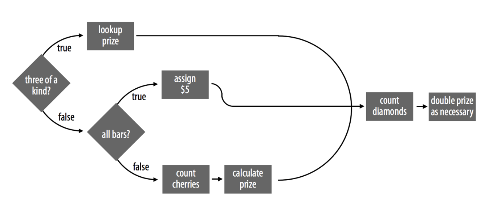

```{r setup, include=FALSE}
knitr::opts_chunk$set(echo = TRUE)
```

# Project 3: Slot Machine 老虎机

老虎机类似于街机游戏，侧面有一个杠杆。只需支付"少量"费用，您就可以拉动控制杆，机器将生成三个符号的随机组合。如果出现正确的组合，您就可以赢得奖品，甚至可能赢得头奖。

在此项目中，您将根据加拿大马尼托巴省的一些现实生活中的视频彩票终端建模，构建一台真实的、可运行的老虎机。

This project will teach you how to write programs and run simulations in R. You will also learn how to:

-   Use a practical strategy to design programs

-   Use `if` and `else` statements to tell R what to do when

-   Create lookup tables to find values

-   Use `for`, `while`, and `repeat` loops to automate repetitive operations

-   Use S3 methods, R's version of Object-Oriented Programming

-   Measure the speed of R code

-   Write fast, vectorized R code

# 9 Programs 程序

在本章中，您将构建一个真实的、可运行的老虎机，您可以通过运行 R 函数来玩它。完成后，您将可以像这样玩它：

```         
play() 
## 0 0 DD 
## $0  
play() 
## 7 7 7 
## $80
```

该`play`函数需要做两件事。首先，它需要随机生成三个符号；其次，它需要根据这些符号计算奖金。

第一步：从一组常见老虎机符号中生成三个符号：钻石 ( DD)、七杠 ( 7)、三杠 ( BBB)、双杠 ( BB)、单杠 ( B)、樱桃 ( C) 和零 ( 0),每个符号出现的概率不同。这一步可以使用`sample`函数实现：

```{r}
get_symbols = function(){
  wheels = c("DD","7","BBB","BB","B","C","0")
  sample(wheels,size = 3,replace = TRUE,prob = c(0.03, 0.03, 0.06, 0.1, 0.25, 0.01, 0.52))
}
```

```{r}
get_symbols()
```

老虎机规则如下：

```         
Each play of the slot machine costs $1. A player's symbols determine how much they win. Diamonds (DD) are wild, and each diamond doubles the final prize. * = any symbol.
```

| **Combination**         | **Prize(\$)** |
|-------------------------|---------------|
| `DD DD DD`              | 100           |
| `7 7 7`                 | 80            |
| `BBB BBB BBB`           | 40            |
| `BB BB BB`              | 25            |
| `B B B`                 | 10            |
| `C C C`                 | 10            |
| Any combination of bars | 5             |
| `C C *`                 | 5             |
| `C * C`                 | 5             |
| `* C C`                 | 5             |
| `C * *`                 | 2             |
| `* C *`                 | 2             |
| `* * C`                 | 2             |

要创建`play`函数，您需要编写一个程序，该程序可以获取输出`get_symbols`并根据表9.1计算正确的奖金。在R中，程序保存为 R 脚本或函数。我们会将您的程序保存为名为`score`的函数。完成后，您将能够使用score以下方法计算奖金：

```         
score(c("DD", "DD", "DD")) 
## 800
```

完整的老虎机程序效果如下：

```         
play = function(){
  symbols = get_symbols
  print(symbols)
  score(symbols)
}
```

现在，创建一个R脚本来编写整个程序：Slot Machine

## 9.1 Strategy

-   Break complex tasks into simple subtasks.

-   Use concrete examples.

-   Describe your solutions in English, then convert them to R.

R 程序包含两种类型的子任务：顺序步骤**Sequential Steps**和并行情况**parallel cases**

让R按顺序吧顺序步骤代码放置在函数中：

{width="526"}

并行案例：

例如，如果符号包含三个同类符号，则score需要以一种方式计算奖品（在这种情况下，score需要将通用符号与奖品相匹配）。如果符号都是条形，score将需要以第二种方式计算奖金（在这种情况下，score可以分配5美元的奖金）。最后，如果符号中不包含三个或所有小节，分数将需要用第三种方式计算奖品（在这种情况下，分数必须计算出出现的樱桃数量）。score永远不会同时使用这三种算法；它将始终基于符号的组合选择仅一个算法来运行。

{width="526"}

合并起来构成完整的程序：

{width="526"}

## 9.2 if 语句

```{r}
num <- -1

if (num < 0) {
  print("num is negative.")
  print("Don't worry, I'll fix it.")
  num <- num * -1
  print("Now num is positive.")
}
num
```

## 9.3 else 语句

if语句告诉R当条件为true时该怎么做，但您也可以告诉R当该条件为false时该怎么办。

举例：四舍五入为整数

```{r}
a = 114.514
dec = a - trunc(a) #trunc()函数分离小数部分
dec #得到小数部分

if(dec<=0.5){
  a = trunc(a)
}else{
  a = trunc(a) + 1
}
print(a)
```

若有逻辑判断有多个互斥情况，则可以使用else if 语句：

```{r}
a <- 1
b <- 1

if (a > b) {
  print("A wins!")
} else if (a < b) {
  print("B wins!")
} else {
  print("Tie.")
}

```

我们初步确定老虎机奖励赋值函数`score`的代码框架：

``` r
if ( # Case 1: all the same <1>) {
  prize <- # look up the prize <3>
} else if ( # Case 2: all bars <2> ) {
  prize <- # assign $5 <4>
} else {
  # count cherries <5>
  prize <- # calculate a prize <7>
}

# count diamonds <6>
# double the prize if necessary <8>
```

八个简单的子任务：

\<1\> - 测试符号是否是三个相同的。

\<2\> - 测试符号是否都是条形。

\<3\> - 根据共同符号查找三个相同的奖品。

\<4\> - 分配 5 美元的奖金。

\<5\> - 数一下樱桃的数量。

\<6\> - 计算钻石的数量。

\<7\> - 根据樱桃的数量计算奖金。

\<8\> - 调整钻石奖励。

此时的流程图为：

{width="526"}

第一个子任务：判断三个符号是否相同，若相同则给出对应奖励

```{r}
symbols = get_symbols()
score = function(symbols){
  if(symbols[1] == symbols[2] & symbols[2] == symbols[3]){
    print("same")
  }else{
    print("not same")
  }
}
print(symbols)
score(symbols)
```

这样初步实现了判断三个元素是否相同，等价的语法还有：

``` r
symbols[1] == symbols[2] & symbols[1] == symbols[3]
## TRUE

all(symbols == symbols[1])
## TRUE

length(unique(symbols) == 1)
```

若三元素不相同，则接着判断元素中是否含有Bar：\

``` r
all(symbols %in% c("B", "BB", "BBB")) #若为ture则获得二等奖
```

此时可以简单丰富一下我们的代码框架

``` r
same <- symbols[1] == symbols[2] && symbols[2] == symbols[3]
bars <- symbols %in% c("B", "BB", "BBB")

if (same) {
  prize <- # look up the prize
} else if (all(bars)) {
  prize <- # assign $5
} else {
  # count cherries
  prize <- # calculate a prize
}

# count diamonds
# double the prize if necessary
```

当三个符号相同时，根据符号类型来分配奖励：

``` r
if (same) {
  symbol <- symbols[1]
  if (symbol == "DD") {
    prize <- 100
  } else if (symbol == "7") {
    prize <- 80
  } else if (symbol == "BBB") {
    prize <- 40
  } else if (symbol == "BB") {
    prize <- 25
  } else if (symbol == "B") {
    prize <- 10
  } else if (symbol == "C") {
    prize <- 10
  } else if (symbol == "0") {
    prize <- 0
  }
}
```

虽然这段代码可以工作，但编写和读取有点长，并且可能需要 R 执行多次逻辑测试才能提供正确的奖励。我们可以用不同的方法做得更好。

## 9.4 Lookup Tables

您可以创建一个向量来捕获信息。该向量可以将符号存储为Name，将奖品值存储为Element

```{r}
payouts <- c("DD" = 100, "7" = 80, "BBB" = 40, "BB" = 25, 
  "B" = 10, "C" = 10, "0" = 0)
payouts
##  DD   7 BBB  BB   B   C   0 
## 100  80  40  25  10  10   0
```

```{r}
unname(payouts["DD"]) #可使用unname()函数在输出结果时去掉Name
```

继续丰富代码框架：

``` r
same <- symbols[1] == symbols[2] && symbols[2] == symbols[3]
bars <- symbols %in% c("B", "BB", "BBB")

if (same) {
  payouts <- c("DD" = 100, "7" = 80, "BBB" = 40, "BB" = 25,    "B" = 10, "C" = 10, "0" = 0) #用向量构建各个符号对应的奖励值
  prize <- unname(payouts[symbols[1]])
} else if (all(bars)) {
  prize <- 5 # 情况二只有一种奖励值
} else {
  # count cherries
  prize <- # calculate a prize
}

# count diamonds
# double the prize if necessary
```

下面进入第三种情况，数樱桃C的个数：

``` r
sum(symbols == "C")
```

进一步丰富代码框架：\

``` r
same <- symbols[1] == symbols[2] && symbols[2] == symbols[3]
bars <- symbols %in% c("B", "BB", "BBB")

if (same) {
  payouts <- c("DD" = 100, "7" = 80, "BBB" = 40, "BB" = 25,    "B" = 10, "C" = 10, "0" = 0) #用向量构建各个符号对应的奖励值
  prize <- unname(payouts[symbols[1]])
} else if (all(bars)) {
  prize <- 5 # 情况二只有一种奖励值
} else {
  cherries = sum(symbols == "C")
  if(cherries == 2){
    prize = 5
  }else if(cherries == 1){
    prize = 2
  }else{
    prize = 0
  }
 
}
diamonds = sum(symbols == "DD")
# double the prize if necessary
```

最后一步，数钻石数量然后考虑事都需要对奖励进行翻倍操作：最后的子任务是每赠送一颗钻石，奖金就会翻倍。这意味着最终的奖金将是当前奖金的几倍.

提取函数为`score`

``` r
score <- function(symbols) {
  # identify case
  same <- symbols[1] == symbols[2] && symbols[2] == symbols[3]
  bars <- symbols %in% c("B", "BB", "BBB")
  
  # get prize
  if (same) {
    payouts <- c("DD" = 100, "7" = 80, "BBB" = 40, "BB" = 25,    "B" = 10, "C" = 10, "0" = 0) #用向量构建各个符号对应的奖励值
    prize <- unname(payouts[symbols[1]])
  } else if (all(bars)) {
    prize <- 5 # 情况二只有一种奖励值
  } else {
    cherries = sum(symbols == "C")
    # if(cherries == 2){
    #   prize = 5
    # }else if(cherries == 1){
    #   prize = 2
    # }else{
    #   prize = 0
    # }
    prize <- c(0, 2, 5)[cherries + 1] #上方的if树可以用查找table的形式实现
  }
  
  # adjust for diamonds
  diamonds = sum(symbols == "DD")
  prize = prize*2^diamonds
}
```

把三个流程整合起来形成`play`函数：

```{r}
play <- function() {
  symbols <- get_symbols()
  print(symbols)
  score(symbols)
}
```

## 总结

把这章节的代码做一个归纳：

``` r
#Slot Machine

#获得三个符号
get_symbols = function(){
  wheels = c("DD","7","BBB","BB","B","C","0")
  sample(wheels,size = 3,replace = TRUE,prob = c(0.03, 0.03, 0.06, 0.1, 0.25, 0.01, 0.52))
}

symbols = get_symbols()
#根据三个符号进行奖励分配
score <- function(symbols) {
  # identify case
  # same <- symbols[1] == symbols[2] && symbols[2] == symbols[3]
  same = all(symbols == symbols[1])
  bars <- symbols %in% c("B", "BB", "BBB")
  # get prize
  if (same) {
    payouts <- c("DD" = 100, "7" = 80, "BBB" = 40, "BB" = 25,    "B" = 10, "C" = 10, "0" = 0) #用向量构建各个符号对应的奖励值
    prize <- unname(payouts[symbols[1]])
  } else if (all(bars)) {
    prize <- 5 # 情况二只有一种奖励值
  } else {
    cherries = sum(symbols == "C")
    prize <- c(0, 2, 5)[cherries + 1] #上方的if树可以用查找table的形式实现
  }
  # adjust for diamonds
  diamonds = sum(symbols == "DD")
  prize = prize*2^diamonds
  prize
}

#整合得到play函数
play <- function() {
  symbols <- get_symbols()
  print(symbols)
  score(symbols)
}
#调用老虎机
play()
```

# 10. S3

## 10.1 S3系统

S3 指的是 R 中内置的类系统。该系统控制 R 如何处理不同类的对象。某些 R 函数将查找对象的 S3 类，然后做出不同的响应行为。

R\'s S3 system is built around three components: **attributes** (especially the `class` attribute), **generic functions**, and **methods**.

您可以使用`attr`;将任何常规属性添加到对象中 您还可以用来`attr`查找对象的任何属性的值。

**Exercise 10.1 (Add an Attribute)** Modify `play` to return a prize that contains the symbols associated with it as an attribute named `symbols`. Remove the redundant call to `print(symbols)`:

```         
play <- function() {
  symbols <- get_symbols()
  print(symbols)
  score(symbols)
}
```

修改：

```{r}
play = function(){
  symbols = get_symbols()
  prize = score(symbols)
  attr(prize,"symbols") = symbols
  prize
}
```

```{r}
play()
```

对函数输出结果显示进行美化：

```{r}
one_play = play()
slot_display <- function(prize){

  # extract symbols
  symbols <- attr(prize, "symbols")

  # collapse symbols into single string
  symbols <- paste(symbols, collapse = " ")

  # combine symbol with prize as a character string
  # \n is special escape sequence for a new line (i.e. return or enter)
  string <- paste(symbols, prize, sep = "\n$")

  # display character string in console without quotes
  cat(string)
}

slot_display(one_play)
## B 0 B
## $0
```

使用`slot_display()`函数来输出`play()`函数的结果

```{r}
slot_display( play() )
```

## 10.3  Generic Functions

`print` is not a normal function; it is a *generic* function. This means that `print` is written in a way that lets it do different things in different cases.

## 10.4 Method

当您调用 时`print`，`print`调用一个特殊函数`UseMethod.`

您可以通过调用`methods`函数来查看通用函数存在哪些方法。例如，`print`有近 200 个方法（这让您了解 R 中存在多少个类）：

```{r}
head(methods(print))
```

由泛型函数、方法和基于类的调度组成的系统被称为 S3，因为它起源于 S 的第三个版本.

10.4.1 方法调用

**练习10.2（创建一个打印方法）** 为slots 类编写一个新的打印方法。该方法应该调用`slot_display`以返回格式正确的老虎机输出

```{r}
print.slots <- function(x, ...) {
  slot_display(x)
}
```

让我们确保每台老虎机的输出都具有类别`slots`

**练习10.3（添加一个类）** 修改`play`函数，以便将其分配`slots`给`class`对应的输出属性：

```{r}
play <- function() {
  symbols <- get_symbols()
  structure(score(symbols), symbols = symbols, class = "slots")
}
class(play())#成功为play添加了slots类
```

R 将以正确的老虎机格式显示它们：

```{r}
play()
```
